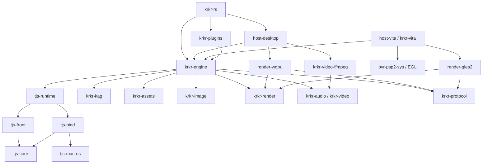

# 软件设计与架构

本文描述当前代码的模块职责、执行流程和资源寿命。项目以 Rust 实现跨平台的 TJS2/Kirikiri 游戏运行能力，保留旧脚本依赖的语言、对象、存储和演出语义。插件范围见[插件兼容清单](插件兼容清单.md)，使用入口见 [README](../README.md)。

## 模块与依赖

根程序负责运行方式选择、参数与服务组装。语言层不认识 Window、Layer 或平台设备；引擎通过公共协议请求宿主服务。下图表示主要依赖方向，省略各层对公共基础库的重复引用。

| 代码位置 | 职责 |
|---|---|
| [src](../src) | 运行方式分派、输入解码、诊断、游戏启动与执行驱动 |
| [tjs-core](../crates/tjs-core/src/lib.rs) | Value、UTF-16 源码定位、代际句柄与堆、寄存器 IR/校验、VM、原生调用和 Trace 契约 |
| [tjs-front](../crates/tjs-front/src/lib.rs) | 词法、预处理、AST、编译、原版字节码导入 |
| [tjs-bind](../crates/tjs-bind/src/lib.rs) / [tjs-macros](../crates/tjs-macros/src/lib.rs) | 原生类描述、参数转换、绑定与追踪宏；Array、Dictionary、Date、RegExp 等标准库 |
| [tjs-runtime](../crates/tjs-runtime/src/lib.rs) | Heap/SourceMap/预处理环境、动态编译、字节码封装、调度器、时钟与等待身份 |
| [krkr-kag](../crates/krkr-kag/src/lib.rs) | 独立剧本解析、标签、宏、条件与调用栈、保存恢复 |
| [krkr-engine](../crates/krkr-engine/src/lib.rs) | 脚本原生类、世界状态、事件/任务调度、图层树、资源与媒体协调、插件 SDK |
| [krkr-protocol](../crates/krkr-protocol/src/lib.rs) | 窗口请求/回执、图像及场景数据、输入、媒体标识、资源预算与生命周期票据 |
| [krkr-assets](../crates/krkr-assets/src/lib.rs) | 存储名、VFS、ReadPlan/WritePlan、XP3、文本与结构存储格式 |
| [krkr-image](../crates/krkr-image/src/lib.rs) | 图像探测、解码、保存、光标/图标及格式适配 |
| [krkr-render](../crates/krkr-render/src/lib.rs) | 公共几何、混合、采样、转场规则、字体度量与字形掩码 |
| [render-wgpu](../crates/render-wgpu/src/lib.rs) | GPU 图片、上传/读回、场景合成、字形图集、着色器与效果执行 |
| [render-gles2](../crates/render-gles2/src/lib.rs) | GLES2 分块纹理、传统混合、逻辑尺寸映射、拉伸/仿射、字形图集、场景合成、转场与显式像素读回 |
| [krkr-audio](../crates/krkr-audio/src/lib.rs) / [krkr-video](../crates/krkr-video/src/lib.rs) | 流式解码接口、播放状态、循环/定位、缓冲、混音和音视频时钟 |
| [krkr-video-ffmpeg](../crates/krkr-video-ffmpeg/src/lib.rs) | 桌面 FFmpeg 视频后端与音频解码适配 |
| [krkr-plugins](../crates/krkr-plugins/src/lib.rs) | 按名称注册的静态 Rust 插件实现，复用引擎 SDK、资源和绘制通道 |
| [host-desktop](../crates/host-desktop/src/lib.rs) | winit 主循环、wgpu、cpal、字体发现、剪贴板、对话框、文件及系统服务组装 |
| [host-vita](../crates/host-vita/src/lib.rs) | PSV 宿主：启动器、脚本启动、内存预算、原生音频、AvPlayer 视频、PVR/EGL、窗口协议、场景显示、模态焦点、控制器与触摸输入 |
| [pvr-psp2-sys](https://github.com/jhq223/pvr-psp2-sys) | 独立维护的 PVR/EGL 绑定、VitaSDK 链接桩及原生驱动构建工具 |
| [pvr-compiler](https://github.com/jhq223/pvr-compiler) | 独立维护的离线 GLSL ES / SGX543 编译器，用于 Vita 着色器预编译 |
| [krkr-convert](../tools/krkr-convert/src/main.rs) | 批量 XP3 操作、媒体一致性清单与修正、PSV 资源缩放 |

引擎不反向依赖具体插件或桌面后端。插件由根程序显式注册；离线转换器也能复用插件中的 XP3 过滤器，无需启动窗口。可移植代码禁止 `unsafe`；PSV 宿主在音频、视频、时钟、PVR、输入和启动符号边界允许 FFI，绑定集中在 `pvr-psp2-sys` 和 VitaSDK 依赖中。

## 语言与运行时

源码在 `SourceMap` 中以 UTF-16 保存，`Span` 使用码元区间。前端执行预处理、词法/语法分析和寄存器 IR 编译；原版字节码通过独立导入路径转换到公共模块表示。源码中的注释和位置供诊断及检查工具使用。

`Value` 包含 Void、Int、Real、String、Object、Octet。Object 同时携带对象和 `this` 引用，null 使用空对象表示；两条引用都参与追踪。数字转换、字符串码元、属性访问、实参求值和脚本类构造采用 TJS 规则。脚本类在构造时复制成员，函数通过显式上下文绑定使用对象状态。

不可变 `Module` 保存可共享代码、常量和来源信息。VM 使用寄存器、显式调用帧及原生续体，`run_slice` 按工作预算推进；调用、属性、异常和原生等待沿原 VM 栈恢复。标准库由 `tjs-bind` 安装，引擎类由 `krkr-engine::install` 安装。

`Runtime` 拥有堆、源码和预处理环境，处理 VM 发出的动态编译请求及诊断。动态 `eval` 恢复到原 VM；编译本身当前仍同步执行。`Scheduler` 管理执行上下文、结果、取消和等待，`TimedScheduler` 增加时钟与截止时间。上下文 ID、等待 ID 和宿主请求 ID 分开，防止迟到回执恢复错误任务。

`RunBudget` 约束指令及续体等工作单位，不是墙钟时间限制，也不能中断任意第三方调用。纯语言执行和引擎调试使用诊断预算，正常游戏启动默认不设累计工作量上限。

## 堆、对象与释放

堆使用 SlotMap 代际 ID 和非移动标记清除 GC。ID 提供身份校验，本身不是强根。`Heap::collect_step` 按预算推进标记、终结器发现与清扫；`Heap::collect` 保留完整收集语义。自动策略在小堆使用完整回收，大堆使用增量回收，分配积压时回退完整回收。设计、限制和测量见 [增量 GC](增量GC.md)。

原生状态通过 `Trace` 枚举受管引用。收集根包含活动及挂起 VM、全局、原生任务、待取结果、事件和显式宿主根；插件保存的函数、旧导出及回调也需保活。运行时通过模块弱引用记录源码使用寿命，动态编译结果释放后可清理关联源码。

脚本 `finalize`、原生失效钩子和堆槽回收分阶段执行。GC 保留待终结对象及其引用，运行时驱动可暂停的终结器；显式失效与 GC 共用对象生命周期实现。析构回调使用正在销毁的实例作为 `this`，保留函数定义的代码池和全局环境。

窗口、图像、字体、媒体和后台任务使用各自的受管身份及释放票据。取消和 `Engine::reset` 清理等待、回调与资源操作，迟到的工作结果不能交付给已失效对象。实现入口为 [heap/gc.rs](../crates/tjs-core/src/heap/gc.rs)、[VM 生命周期](../crates/tjs-core/src/vm/lifecycle.rs)和 [Engine](../crates/krkr-engine/src/engine.rs)。

## 启动、调度与线程

根程序提供纯语言执行、引擎脚本调试和游戏启动三条路径。语言路径只安装标准库；引擎路径增加存储、原生类、静态插件和 PC 服务；游戏路径进一步建立资源目录、存档配置和入口脚本。

游戏启动见 [game.rs](../src/game.rs)。默认入口为 `startup.tjs`，也支持指定归档内脚本。资源过滤器在读取入口和补丁资源前安装，`xp3filter.tjs` 使用隔离解码 VM；`patch.tjs` 在同一游戏上下文中先于入口执行一次。资源搜索、归档和自动路径规则由 VFS 与游戏设置决定。

`Engine` 是单线程世界所有者，通过 `poll` 驱动脚本、计时器、输入和系统/媒体回调。桌面模式中，winit/OS 窗口与 GPU 位于主线程，游戏执行位于宿主创建的工作线程；两端通过公共协议的拥有数据通信。无窗口模式仍组装文件、字体和媒体服务。

原生调用生成有类型的请求，将可恢复状态保存在 VM 续体中，再等待回执。[operations.rs](../crates/krkr-engine/src/operations.rs) 管理挂起操作；[io.rs](../crates/krkr-engine/src/io.rs) 提供惰性、有界的阻塞 IO 工作线程。后台工作接收拥有的读取计划和数据，不持有 VM、Value 或引擎状态借用。音视频服务管理自己的缓冲和播放工作，设备输出回调不执行脚本。

内部绘图/IO 等待与显式事件等待分开。同一窗口的一轮 `onPaint` 在一个可恢复回调中按图层顺序完成，结束后允许发布场景，避免显示清空到重绘之间的中间状态。宿主通过唤醒和最近截止时间休眠。

## 存储与资源

VFS 统一处理本地路径、XP3、自动路径和已注册存储介质。`ReadPlan` 固定一次读取所需的来源与名称，后续目录或挂载变化不重新解释已经开始的读取。插件介质通过资产库接口接入，资产库不依赖脚本对象。

图像加载依次完成名称解析、关联 mask/province 查找、头部探测、资源准入、解码和上传。尺寸与预算先于像素分配确认；后台结果进入有序宿主请求，成功后更新图层逻辑状态。字体、音视频与图片使用工作队列和各自预算。

`System.touchImages` 复用正常图像加载和 GPU 缓存路径，按 limit/timeout 预载，不修改图层。正常加载仍报告读取错误，预载可跳过单张失败。没有图形上下文时跳过可选预载；成功缓存不保留 CPU 解码副本，预算压力下仍可逐出。

资源预算通过票据随数据寿命持有，区分图片驻留、CPU 像素、上传/读回暂存、字体及媒体缓冲。缓存逐出只释放缓存所有权，活动图层或在途提交仍可持有资源。策略入口为[桌面内存配置](../crates/host-desktop/src/memory.rs)和[协议预算](../crates/krkr-protocol/src/budget.rs)。

## 绘制、文字与媒体

`Layer` 拥有脚本属性、图层树与受管图像引用；OS 窗口和 GPU 纹理由后端拥有。场景快照、图像版本和生命周期票据通过协议传给渲染器，避免跨线程访问脚本对象。

GPU 图片在图层赋值或缓存命中时可以共享，修改时按逻辑所有权执行写时复制。普通显示使用驻留图片和合成命令，读取像素、保存图像等显式需求走有预算的读回。需要隔离源目标的绘图使用受管快照，具体与旧 CPU 就地算法的差异记录在插件清单。

`krkr-render` 提供公共几何和采样规则，`render-wgpu` 实现纹理、上传、混合、裁剪、转场及批量网格/粒子效果。绘图命令保持顺序，提交持有引用直到后端完成。场景合成复用资源，需要蒙版或离屏合成时使用预算内的临时表面。

文字测量和绘制共用 `krkr-render::font::System`，桌面宿主提供系统字体发现和私有字体注册。默认 QiushuiShotai 字体随 crate 嵌入，独立于系统字体和本地参考目录；显式文件字体与预渲染字体按读取结果处理。公共字体层生成字形掩码，GPU 后端维护字形图集。

窗口客户区、脚本缩放和图层偏移组合成公共坐标映射，显示、命中和输入共用映射。用户拖动窗口采用等比居中的画布适配，图层逻辑尺寸和图片尺寸保持各自含义。

`Window.update()` 在调用它的 VM 上完成该窗口待处理的 `onPaint`，覆盖隐藏子图层及转场源，随后通过共享场景通道提交刷新；支持省略参数、`utNormal` 和 `utEntire`。绘制回调可以暂停或执行原生 IO，同一窗口的递归刷新被抑制，异常或取消会释放绘制状态。方法返回前完成场景提交，实际 GPU 呈现仍由宿主执行，不进行帧缓冲读回。相关测试位于 `krkr-engine/tests/support/window_update.rs`。

`krkr-audio` 提供流式解码、混音、循环和样本位置，`krkr-video` 提供视频服务、有限缓冲与音视频时钟。桌面通过 cpal 输出音频，以 `krkr-video-ffmpeg` 适配 FFmpeg。媒体资源从 VFS 读取，游戏播放不依赖外部 `ffmpeg` 命令。

共享音频服务默认限制为 16 MiB，为视频音轨和滤镜留出余量；这是按需分配的上限，不是启动时预分配。混音队列按实际容量计入预算，保留每路 4096 帧；内置解码器另留 512 KiB 保守额度，交错样本缓冲随实际音频包增长并单独计费，PCM 输入不预留解码器空间。仅带平滑循环的 `.sli` 分配交叉淡化缓冲，仅带标签的音轨分配通知队列；可视化、滤镜及宿主解码器保留各自的预算。`stop()` 保留重播所需状态，重新打开或销毁后由实际资源所有者释放额度。`krkr-audio/tests/budget.rs` 仍用旧的 12 MiB 上限验证 15 个音效槽加 2 个平滑循环 BGM 缓冲、重播、预算拒绝及释放，防止提高默认额度掩盖缓冲浪费。

媒体分发先解析 VFS 名称，再由对应媒体服务检查内容。图片通过文件头选择 PNG/BMP/JPEG/WebP/TLG 解码器，扩展名用于无头 DIB 等补充识别；音频由 Symphonia 探测容器/编码，TCWF、Opus 和扩展后端受插件注册控制；普通视频交给 host 的 `krkr-video::Backend`，桌面实现使用 FFmpeg 探测。AMV/AJPM 由 `AlphaMovie` 插件与 `krkr-image::amv` 专门处理。规范化后的后缀与实际容器一致，但后缀不能单独承诺编码支持，例如 Ogg 中仍可能包含 Vorbis 或 Opus。工具的内容一致性检查与宿主/插件解码能力是两项不同的检查。转换器额外采用游戏资源约定：`.ogg/.oga` 要求 Vorbis，容器内的 Opus 标记为不匹配并转码，明确的 `.opus` 保留 Opus。带 `.sli` 的转码比较实际解码采样数、采样率和声道，不能用包含编码延迟的容器时长替代；无法保持时拒绝替换。

PSV 资源保留游戏原逻辑坐标。图片和普通视频的 `<实际文件名>.krkr-scale` 存储原尺寸与实际像素尺寸；图片探测及两个视频打开入口读取并校验它。普通图片上传紧凑像素，通过 `UploadScaled` 和渲染器的延迟变换表达原逻辑尺寸，裁剪、缓存赋值及像素读取继续使用原坐标；省份图保留索引，需合成省份平面时恢复逻辑像素。特效视频的桌面 RGBA 帧在后台恢复逻辑尺寸，Vita YV12 帧由 GPU 转换并按逻辑坐标复制；左右分离 alpha 均取右半幅蓝通道。源纹理可更小，但逻辑尺寸的读回、修改与合成仍可能分配较大的临时表面。

普通视频转换为真实 MP4 文件：`opening.avi` 生成 `opening.avi.mp4` 和内容固定的 `opening.avi.krkr-mp4`。VFS 在原文件缺失时校验标记并解析 MP4，目录、XP3 及自动路径共用此行为；真实同名资源优先。转换不改写 TJS/KAG 文本或字节码。两种附属文件都必须随资源封包。

PSV 视频配置固定为 MP4、H.264 Main（Level 上限 4.0）、8-bit YUV 4:2:0、BT.601 limited 矩阵与范围、偶数尺寸且不超过 960×544/60fps，可选 AAC-LC 48kHz 双声道；转换验证容器、编码、尺寸、帧数和完整解码。AMV 保留专用解码。公共 `VideoPixels` 分为桌面 RGBA 和 Vita YV12（紧凑 Y、V、U 平面）；YUV 是像素表示，与 MP4 容器和 H.264 编码分层。`UploadYuv` 与 `CopyYuv` 通过两个缓存的 LUMINANCE 纹理和 GLES2 shader 转换成缩小尺寸的 RGBA 纹理，不在 CPU 上恢复 RGB。硬解入口为 VitaSDK 的 SceAvPlayer，桌面 FFmpeg 后端继续输出 RGBA。

## 插件与兼容补丁

`Plugins.link` 按注册表选择 Rust 提供者，不装载旧 DLL 机器码。已登记名称可共享同一插件身份，未知名称报错。引擎负责注册、导出、依赖和寿命，`krkr-plugins` 负责具体业务；宏和 SDK 复用标准类绑定、参数转换和同 VM 原生续体。

兼容补丁使用现有 TJS 函数、类与字典：

| 接口 | 行为 |
|---|---|
| `Plugins.mock(name, spec = void)` | 注册替换提供者，截断下层实现；省略 spec 表示明确跳过该插件且不安装导出 |
| `Plugins.patch(name, spec)` | 加载下层后安装扩展；没有下层时报错 |
| `Plugins.alias(alias, target)` | 增加共享同一插件身份的新别名 |
| `Scripts.afterLoad(name, handler)` | 匹配的 `execStorage/evalStorage` 成功后，在返回前运行补丁回调 |

`spec` 包含 `priority`（默认 100）、`globals`、`onLink`、`onUnlink`。内置提供者优先级为 0，数值越大越靠外，同优先级声明报错。声明在注册时保存并追踪，首次真正 link 时安装，重复 link 不重跑同一层的安装回调。

`onLink(p)` 可调用 `p.export`、`p.extend`、`p.hook`。导出先暂存，成功后提交；`hook` 将下层函数作为 `next` 参数传给处理器，异常/等待/取消沿同一 VM 传播。安装上下文只在本次安装期间有效；类扩展遵循成员构造时复制的规则，影响之后创建的实例。

所有别名释放后才尝试卸载。在用资源检查及 `onUnlink` 可以拒绝卸载，受管导出按逆序恢复，不能覆盖游戏后来替换的成员。加载失败回滚受管导出并清理可释放资源；任意脚本赋值、外部 IO 和自行发布的对象不属于自动事务。导出日志、原方法和回调均由 GC 保活。实现见 [plugins](../crates/krkr-engine/src/plugins.rs)及其子模块。

`Scripts.afterLoad` 对无目录名称匹配文件名，对带目录名称匹配调用使用的完整存储名，统一斜杠并折叠 ASCII 大小写。加载前选定回调列表，重复登记追加；失败不触发，回调异常传播，reset 清除登记。纯内存 `eval/exec` 和 `compileStorage` 不触发它。实现见 [scripts/hooks.rs](../crates/krkr-engine/src/scripts/hooks.rs)。

插件优先级只在注册/加载阶段解析，正常调用直接使用安装后的函数。显式 mock 是补丁声明，不计入原插件实现。菜单保留脚本对象、状态及约定回调，不呈现原生菜单；裸指针、Win32 消息钩子、COM/ActiveX 等旧能力按具体入口适配或报告缺失。

## PSV 宿主

`krkr-vita` 通过 `cargo vita` 构建，使用 ons-rs 的 Vita 配置、PVR/EGL 绑定、链接桩和四个 GPU 运行模块。EGL 留在主线程，VM 使用独立 1 MiB 栈线程，资产 IO 继续使用引擎有界工作队列。主线程栈为 2 MiB，newlib 堆为 160 MiB，libc 堆为 16 MiB；位图与字体预算分别为 64 MiB、8 MiB。时钟租约采用 ARM 444 / 总线 222 / GPU 222 / crossbar 166 MHz，退出或设置失败恢复原值。POT/NPOT 采样纹理采用 stride 布局。

`package.metadata.vita.assets` 指向 `runtime/`，打包 GPU 模块、`sce_sys/icon0.png`、`pic0.png`、LiveArea `template.xml`、`bg0.png`、`startup.png` 及字体许可证。图片分别为 128×128、960×544、840×500、280×158，使用索引 PNG；背景保留 ons-rs 原图，气泡与启动按钮使用原创美少女图标。字体通过公共服务编入程序并共享解析结果，VPK 不重复存放 TTF。仓库只保留打包所需的最终图片，普通构建直接打包已提交资源。

`render-gles2` 在宿主当前 EGL 上下文中创建，渲染器和图片禁止跨线程移动，并在 EGL 销毁前释放。普通图片按纹理块保存，默认块边长 1024；共享图片修改时仅复制受影响的块。缩小资源保留逻辑尺寸，显示、复制和指定区域读回在 GPU 上映射坐标。Vita 根据主窗口的脚本尺寸和 960×544 面板计算画布像素密度：新建、Resize、填充、复制、混合、文字、普通仿射变换、精灵和网格绘制直接操作缩小存储；脚本坐标保持不变。原始上传、已按显示尺寸生成的内部缓冲不重复缩放。省份图以及尚采用精确逻辑像素算法的邻域滤镜、扫描线等仍使用原尺寸路径。普通绘图不保留 CPU RGBA 副本，也不进行像素读回。显式读取原尺寸图像的块内区域时直接读取对应渲染目标，跨块区域和缩小资源才需要临时映射。后端默认常驻 80 MiB、临时 16 MiB，共享 96 MiB 上限；Vita 宿主将临时上限提高至 48 MiB，与常驻池共享 192 MiB 总额，允许借用闲置额度。CPU 暂存默认 32 MiB。纹理和网格缓冲释放先进入待回收队列，GPU 完成后才归还预算。Vita 设置 PVR `FlushBehaviour=2` 使 glFinish 等待 3D 完成，采样纹理采用 `OverloadTexLayout=0x11` 线性布局以支持任意区域回存；工作 FBO 使用独立 renderbuffer。

Vita 为重复修改的 RGBA 画布缓存纹理 FBO，最多 8 项，附件图像合计不超过 8 MiB。附件沿用原图像存储和预算，驱动渲染表面另占内存。已缓存目标直接接收绘制，纹理存储复用时保留附件，实际删除纹理前释放 FBO。PVR 的渲染面归附件纹理所有，驱动可回收闲置表面而保留图像；单独删除 GL FBO 不保证立即释放底层资源。引擎槽位计费持续到纹理分配销毁，缓存满时使用工作表面。常色纹理和小字形不进入缓存，压力回收释放已退休的纹理及其附件。

需要采样目标旧像素的混合和文字批次仍使用独立工作 FBO：将旧内容加载到线性 RGBA8 renderbuffer，采样原图像纹理，完成后只回存修改区域。批次期间不将目标切换到纹理 FBO，避免同时采样和写入同一纹理。相邻字形复用工作表面，重叠字形及阴影按顺序回存所需区域。工作表面初始为 1024×1024，计入临时预算（4 MiB）。桌面默认使用直接 FBO 路径。

普通帧维护与强制回收分开：Vita 将已释放的同尺寸 RGBA 纹理放入最多 32 项、16 MiB 的复用池，原预算凭证随存储保留，新近使用的表面替换旧项；重新租用时只在 GPU 清空旧像素，不重新上传零缓冲。分配预估先扣除同尺寸、格式与预算池的可复用项，合成分带预估不提前清空缓存。宿主按紧凑画布的实际新增存储和写时复制需要申请额度。池外退休纹理达到 4 MiB 或 64 项后批量等待并释放；缓冲区退休计入相同批次；预算压力、工作目标扩容和退出仍保留必要同步，预算凭证随实际释放归还。场景内部完成脏区域回存而不额外执行 GL flush，主窗口的最终提交交给 EGL swap。启动器和游戏都只用颜色绘制，EGL 不再要求默认帧缓冲带有深度和模板。

Vita 常驻池上限为 192 MiB，临时池上限为 48 MiB，两者共用 192 MiB 软件总预算。驱动可以从 CDRAM 或 MAIN 分配纹理，这一软件预算不对应单个物理内存分区。工作缓冲和其他临时资源会扣减常驻图片可用额度。

连续 2–4 个普通 Alpha 叶图层在覆盖区域相同、每张输入图像只有一块纹理时，合并到一次绘制，输出仍可跨多个纹理块。融合程序保持脚本顺序、每层不透明度、父绘图面及每步 RGBA8 舍入，最多使用六个纹理采样器；组透明度、不同覆盖区域、多块输入和转场保留原路径。纯色背景结合保守写入边界，直接以字节颜色参与混合，未修改区域不复制或采样背景。18 个融合变体与常见纯色背景混合变体均提前生成 SGX 二进制；实际链接程序保留六项融合 LRU。回归测试位于 `render-gles2/tests/scene_batch.rs` 和 `constant_backdrop.rs`。

静态透明分组按裁剪后的实际像素尺寸合成，并可缓存已完成子树。缓存最多 8 MiB、32 项，计入常驻预算；签名记录图层几何、混合、子节点顺序及源纹理的弱身份和写入代数。缓存不保留源纹理强引用，不因上一帧缓存触发源图像写时复制；维护时淘汰所有者消失、源纹理释放或已写入的结果，预算压力时清空可选缓存。组透明度在缓存结果合成到父目标时应用。含转场的场景仍按当前相位重算，不复用静态子树缓存。

GLES2 绘制按种类、采样方式、混合模式、绘图面和仿射清除选项生成专用程序，整数混合函数仍共享，少见模式也不加载完整的动态分发着色器。原始复制程序常驻，其余绘制程序使用最多 24 项的 LRU，淘汰后再编译新程序。链接完成后解除源着色器 attachment；共享顶点阶段用于后续链接，其余源着色器随即释放。转场按效果、绘图面及采样方式生成程序。Vita 字形页保留计入 staging 预算的 L8 镜像，同一批文字的缺失字形合并为一次整页替换上传；常规 512×512 页每页占用 256 KiB CPU 缓冲，最多四页。已缓存字形不重复上传；CPU 字形、加粗扩展、阴影遮罩统一通过字体服务的 LRU 预算分配。命中检测读取实际存储尺寸的透明度或省份值，紧凑命中平面按像素中心映射脚本坐标，不先生成逻辑尺寸的完整 RGBA 图像；显式图片导出仍保留原有逻辑尺寸语义。

混合、填色、字形覆盖率使用 GLSL ES 1.00 的字节数值规则和公共查找表。字形图集使用单通道 LUMINANCE 采样，常规页为 512×512、最多四页；可写的省份图仍使用 RGBA 纹理红通道，预算按实际四字节像素计入，不依赖可渲染 R8 扩展。最近邻仿射和精灵直接采样原纹理块，双线性仿射的邻域先在 GPU 上合并，避免块边缘接缝。高阶拉伸复用公共采样系数；直接 FBO 后端每批处理 64 个采样点，带符号累加值编码为 RGBA8，每轴结束后量化为字节。Vita 后端改用原生 CPU 浮点逐行执行相同滤波核和逐轴量化，只读所需紧凑源区域、保留一行中间结果并上传输出区域，避免四通道多遍回存和对应 PVR 着色器编译失败。GLES2 像素测试使用 Mesa ES2 或 Windows ANGLE 上下文。

精灵命令先按绘图面清除旧区域，再按批次顺序应用每个精灵的透明度。扫描线命令只在 CPU 整理有界行参数；跨行地址、整数插值及原半像素循环保留的空位由 GPU 处理。循环复制按目标图像的绝对坐标计算源矩形内的循环位置。解码帧复制保留目标尺寸和省份图，分离透明度时由右半幅蓝通道写入左半幅 alpha。透视映射复用公共单应矩阵，使用真实三角形覆盖和源透明度混合；每个像素的四个插值点直接采样相邻纹理块，缩小资源不必恢复逻辑尺寸存储。上述命令及源目标共享写入均有像素回归；真实 TJS perspective 插件也通过 Vita host 的窗口协议执行像素与卸载测试。

Meshes 将顶点和 u16 索引写入 GPU 缓冲，提交前验证批次并固定全部源图像版本。原尺寸单纹理使用硬件双线性采样；跨块或缩小的纹理使用四点采样，跨块时保留每个三角形的绘制顺序。不可变素材按生命周期缓存，热帧不重复计入上传预算。AlphaMax、MultiplyAdd、Alpha、LayerAlpha、着色和遮罩均在 GPU 执行；没有 `EXT_blend_minmax` 时逐三角形复用旧 alpha 表面并分两遍绘制。遮罩按目标纹理块生成，连续使用相同遮罩的绘制复用结果，嵌套遮罩不递归应用。遮罩和 alpha 表面在后续批次复用，不为每个部件或帧重复分配。Mesa ES2 测试覆盖两种 AlphaMax 路径、紧预算遮罩、边缘块、纹理缓存和共享写入；真实 E-mote/D3D 脚本通过 Vita host 执行并检查输出像素。

Warp 的透镜、旋涡和特殊拉伸在 GPU 上执行，保留原整数插值、边缘舍弃、alpha 写入和 32 位溢出规则。GLSL ES 1.00 用四个字节表示整数并显式进位，普通颜色仍使用 RGBA8 纹理。透镜表按其生命周期缓存；强度迭代利用已穷举验证的周期缩短到最多 45 步。拉伸在 CPU 准备每块的固定点起点，避免大坐标转换为浮点时丢失低位；需要混合目标时只复用一块临时旧图。三种效果直接采样缩小素材和相邻纹理块，并通过像素测试及真实 filter.dll 脚本验证。旋涡的三角函数仍可能存在不同 GPU 间的浮点差异。

基础 Adjust 已接入 GLES：灰度、直通及加算 Alpha Gamma、水平/垂直翻转、RGB/HSV 色域填充，以及插件的替换和混合渐变。灰度、Gamma 和混合渐变只复用一块受影响区域的旧像素纹理；替换填充无需临时旧图。Gamma 查表保留整数值并随来源寿命回收。翻转用不可变源版本同时处理主图和省份图，在两张图都成功后发布结果。测试覆盖裁剪、缩小素材、纹理块边界、写时复制和低预算失败，并通过实际引擎及 ksupport 脚本验证；HSV 的浮点换算允许 GPU 间一个色阶的差异。

Lines 复用提供者的 32 像素分块索引，每批最多在 GPU 上顺序执行 16 条线；普通 Bresenham、抗锯齿、渐隐和打包通道的溢出位保持原行为。CPU 仅准备线条参数，GPU 复用 640 字节参数纹理与至多 32×32 的旧像素纹理，临时纹理总量至多 4736 字节，不随线条数量增长。索引先完整校验，再修改目标；省份图和已有快照保持原版本。实际 YADraw/集中线脚本与独立整数像素基准均已验证。

BoxBlur 在两个方向分别求整数和，最后才执行一次取平均，保留小核倒数舍入、图像边缘的实际样本数，以及 Alpha 模式的预乘和反预乘。临时纹理按通道和输出块复用；按半径选择计算方向，预算不足时缩小输出块，宽核分成固定采样批次。求和使用 RGBA8 的四字节整数，避免超过浮点精确范围时丢失低位。保留原主图供所有邻域读取，所有块成功后一起发布结果；裁剪只限制输出，省份图保持原版本。GPU 像素测试覆盖缩小素材、跨纹理块、宽核、低预算和大整数求和，真实引擎脚本验证两种 Alpha 行为。

Filter 的查表、着色、HSL 调节、MSVCRT 噪声、异或、抖动及两套随机填充已在 GPU 执行。逐像素操作复用受影响区域的旧图；无需旧颜色或 Alpha 的随机填充只分配参数纹理。CPU 为每行准备种子、每列准备 LCG 仿射变换与行尾标记，GPU 用一次整数乘加取得对应状态，避免逐像素的长循环。参数规模随块的边长增长，保留旧插件的打包行尾、32 位溢出及特殊 Alpha；查表纹理随来源寿命回收。整数像素基准和三种插件的真实脚本均已验证，HSL 允许不同 GPU 浮点运算造成一个色阶的差异。

Gaussian 和 Smudge 以裁剪区域作为采样边界，同时处理直通 RGB 与 Alpha。Gaussian 保留插件的积分权重、小图索引、边缘归一化和逐轴舍入；每批最多 64 点，浮点累加编码到 RGBA8，复用高阶拉伸的编解码函数。Smudge 取八邻居平均，越界邻居用中心像素替代。两者复用两张区域纹理和小块工作区，Smudge 的临时显存不随迭代次数增长；预算不足先缩小工作块，仍无法容纳则在写入前拒绝。GPU 基准覆盖裁剪、缩小素材、纹理边界、跨页核表和低预算，插件脚本验证 Gaussian、Smudge 与 Blur 入口。

场景提交与图像请求共用顺序栅栏，宿主在读取后续请求前固定场景引用的纹理版本；绘制后释放源图像租约，只保留完成的画布用于重绘。Vita 显示画布、透明分组及转场中间图按显示密度分配，画布至多为 960×544，不放大原本更小的脚本画布。图层位置、裁剪、转场相位及效果表保留逻辑坐标，像素中心统一映射到实际纹理，缩小素材无需展开。普通图层树按临时预算分带合成，同级透明分组复用中间表面；组透明度和混合在子树完成后应用。CrossFade、Universal、Scroll 和 `krkr.extrans.v1` 的 wave、mosaic、turn、rotate、ripple 在 GPU 上执行；自定义转场表和提供者租约保持到 GPU 完成。持久脚本合成、重新合成与 PiledCopy 截取保留请求的逻辑尺寸及原点，GPU 存储使用主窗口密度；精确像素导出再按逻辑尺寸返回数据。GPU 测试验证非整数缩放、嵌套分组、跨块采样和逻辑转场坐标；1080p 普通窗口在 3 MiB 临时预算内输出 960×540，带子树的淡化转场在 10 MiB 内完成。空间转场对已经缩小的子树做最近邻采样，细节精度受该表面分辨率限制。

Vita 窗口的 `SceneState` 只保存上一帧的图层几何、弱纹理身份与写入代数；元数据计入 staging 预算。纹理保留最近 16 次区域写入，显示更新将变化范围映射到实际像素，只合成该区域并写回保留画布，不读回 CPU RGBA。移动、隐藏和裁剪变化覆盖旧、新区域，纹理更换或历史溢出保守扩大范围；节点数量、画布尺寸变化及转场回退完整合成。无像素变化时跳过合成。局部合成沿用全局坐标和嵌套混合语义，不影响脚本截取的完整事务接口；宿主更新失败的画布不得呈现。

窗口保留脚本客户区尺寸并统一映射到 960×544；其他逻辑窗口按主窗口比例和相对位置叠放，模态窗口拥有独占输入。模态结束先恢复焦点再回复等待请求，跨窗口按住的按键/触点必须先松开。左摇杆移动光标，前触摸屏模拟左键，圆圈/叉对应左右键，三角为 Ctrl，方块为空格，Start 为 Esc，Select 为 Enter，肩键为 PageUp/PageDown，方向键保持方向键语义。光标空闲两秒或触摸时隐藏；游戏自定义光标保留像素和热点。绘图和输入使用相同的取整比例，黑边触摸不能激活边缘按钮。窗口消息对话框、目录选择、IME 和部分桌面扩展仍受平台能力限制，不提供伪造的成功选择。

音频输出由专用线程持有 SceAudioOut 端口，固定 1024 帧、48 kHz 双声道，双缓冲 PCM 转换。公共混音器只消费已经解码的有界 PCM，通过设备剩余样本数计算播放延迟；输出错误回传引擎，退出先排空设备再销毁缓冲。音频线程不运行脚本、读取文件或解码。

Vita 的 `ux0:/...`、`app0:/...` 等原生挂载映射为 `file://ux0/...`、`file://app0/...` 存储域，父路径不能跨出挂载根。运行时写入使用同目录独占暂存目录，完成并关闭文件后发布；挂载不支持覆盖式 rename 时备份旧文件，失败回滚，回滚失败保留备份并报告位置。该后备过程不是断电事务，也不对每次写入执行 `sync_all`。离线 XP3 工作流及其 tempfile/rustix 依赖不编入 Vita，必需的 XP3 名称校验由独立模块共享。

启动器复用 ons-rs 的 GLES2 渲染、字体图集和页面结构，调整为无图标的五行文字列表，使用深蓝渐变、静态波纹、圆角和青色选中态；仅交互变更时重绘。字体引用公共服务的同一份秋水书体，字形图集最多三个 1024×1024 单通道页，离开启动器时释放其 GPU 资源，随后创建游戏渲染器。加载提示只绘制一次，游戏窗口在首个可见画布就绪后才接管显示；隐藏窗口的快照仍正常处理，以免阻塞启动指令。应用名称为 KRKR，唯一游戏根目录为 `ux0:/data/KRKR/`，首次扫描含 TJS 或 XP3 的直接子目录，之后读 `launcher.tsv` 缓存；R 主动刷新。扫描只看文件名，实际挂载与加载留给 VM 启动。

上下选择，圆圈、叉或 START 启动，方块打开设置页，SELECT 打开关于页，L 切换中英日语言，三角退出或返回；触摸先选择，点击已选行启动。设置页修改当前游戏的左摇杆光标速度、调试开关、性能显示和启动文件，慢速、标准、快速对应 320、520、800 显示像素/秒；列表、语言、选择和设置一起保存在 `launcher.tsv`，旧版四字段及六字段游戏配置仍可读取，新增性能开关追加在第七字段。

启动器在首次显示列表和切换语言时预热全部设置标签、速度与开关状态、提示和已保存的启动文件名；设置页切换不再生成新字形或上传图集。Vita 的 `create_engine` 在没有注入系统宿主时安装 `VitaSystem`，为 `System.createAppLock` 提供按 UTF-16 名称互斥的进程内锁；同一应用不能在 Vita 上重复启动，锁随引擎销毁释放，不写持久锁文件。

启动文件默认 `startup.tjs`，选择器限制在当前游戏目录，支持子目录和 `data.xp3>scripts/boot.tjs` 归档成员。PSV 与 PC 的 `play` 都会先自动执行游戏根目录的本地 `patch.tjs`；不存在时跳过，补丁失败时停止启动，XP3 同名文件不会替代该补丁。补丁接口与示例见[兼容补丁](兼容补丁.md)。只在用户进入 XP3 时读取该包索引，不扫描全部内容；三角返回上级，方块恢复默认。入口交给同一 VFS 解析后执行。调试默认关闭，开启后脚本日志输出至控制台；Vita 宿主不提供日志目录或文件写入能力，由外部日志插件收集输出。每次游戏使用新的 VM、协议通道和 GPU 缓存，保存目录为游戏下的 `savedata`。启动错误和游戏退出返回列表；START + SELECT 按住一秒请求关闭，取消 VM 并断开等待中的窗口请求。完整启动和运行错误只输出控制台，不额外写入错误日志。

AvPlayer 在媒体工作线程创建和销毁，通过文件替换回调读取 VFS 的可取消流，支持散文件和 XP3，不先提取整段视频。原生分配器、物理连续视频缓冲和队列中的 YV12 帧共享 24 MiB 预算；SDK 输出帧在下一次调用前复制到受预算约束的拥有型缓冲。播放、暂停和跳转映射到 SDK；PCM 交给公共音频服务输出和计时，较短的音频轨结束后继续视频时钟。SDK 仅暴露毫秒时间戳，当前帧率由首个帧间隔估算，总帧数由时长推算；画面调度使用实际 PTS，按帧定位精度及硬件变速支持仍需真机检查。不会为普通视频回退到软件解码。

VM 附加窗口协议并注册可移植插件；字体使用公共服务内置的秋水书体及游戏私有字体，不扫描系统字体。SQLite 的默认 VFS 依赖 Vita newlib 缺少的接口，Vita 不启用 `krkr-plugins/sqlite`，PC 默认启用。主机没有发放预付绘图批次。Vita 的 Date 与 ZIP 时间统一通过 `tjs-bind::date::timezone` 调用平台日历转换。宿主在创建引擎时安装 `SceRtc` 的 UTC↔本地转换，日期读取、构造、修改、解析和时区偏移都遵循设备设置，Unix 时间戳保持 UTC；不依赖 `readlink`、Unix zoneinfo 或修改进程 `TZ`。Jiff 继续负责日历运算和 PC 的时区/DST 规则，Vita 本地夏令时行为由系统 RTC 决定；RTC 范围外日期及转换失败明确返回错误。已有真机启动、图像输出及整帧改造复测记录；《Yosuga no Sora HD》持续剧情仍约 1.4–2.5 FPS，分配、回收等待和合成往返仍需优化。Mesa 像素测试与交叉编译通过不代表达成 60 FPS，具体数据见 [PSV 文档](PSV.md#驱动依据与-60-fps-目标)。

PC 的 `--show-stats` 与 Vita 每游戏“性能显示”独立于 debug，默认关闭。两端共享 `krkr-render::overlay` 的计数器和 240×60 点阵面板：仅计实际游戏画面更新，每秒采样并上传一次，静止时只为面板每秒重绘保留画布，不驱动 VM 回调、不计面板自身为游戏帧。PC 在现有呈现提交中追加一个渲染 pass；Vita 复用 GLES 纹理叠加。关闭时不创建面板资源、查询内存或增加唤醒。GPU 数值来自已有 resident/scratch 预算，是资源分配量；PC RAM 为当前进程驻留量，使用 [memory-stats](https://docs.rs/memory-stats/1.2.0/memory_stats/) 的 `always_use_statm` 避免 Linux smaps 扫描；Vita 用 `sceKernelGetFreeMemorySize` 查询内核可分配的普通内存并标为 RAM FREE，不遍历或锁住 malloc 空闲链表。它不表示预留 newlib 堆内部的余量。

## 通用性能路径

以下优化由 PSV 与桌面共用，或在 GLES2、wgpu 两个后端分别实现：

- `tjs-core` 的长字符串追加直接读取独立后缀；追加自身或旧前缀使用同一缓冲区内复制，保留已有字符串的不可变视图。来自其他共享缓冲区的后缀仍走通用路径，GC 的前缀长度和存活规则保持一致。
- VM 首次成员解析已找到脚本或可暂停的原生 getter/setter 时，直接进入已选中的访问器，避免再查一次成员、属性与调用上下文。缺失成员仍走原有继承和全局回退；属性暂停、异常、返回值与 GC 根保持原语义。
- VFS 搜索自动路径前若已命中显式的普通文件或归档成员，返回该次解析的 `ReadPlan`，引擎的图片/脚本等资源解析和路径查询直接复用，避免确认存在后再次解析。计划打开时仍验证文件版本；转换视频保留请求名与实际 MP4 名的区别。包含自定义存储的搜索继续按顺序解析候选，不提前执行或缓存脚本回调。
- XP3 压缩段回跳或切换压缩段时重置并复用当前解压器，保留解压状态和输入缓冲的存储，丢弃旧缓冲内容；普通段直接持有文件限长视图，省去每次建立段时的额外装箱分配。原有重新打开文件和版本检查继续执行，过滤器仍接收逻辑偏移，独立流的游标与过滤状态保持隔离。
- 图层坐标、尺寸、图像偏移、透明度和中性色写入相同值时，不再发布重复场景或刷新自更新转场。参数校验和脚本属性调用照常执行；显式 `update()` 与 `callOnPaint` 仍请求绘制。
- E-mote 加载时记录关键帧时间是否有序，逐帧采样对有序序列使用二分查找；重复时间选择最后一个不晚于当前时刻的帧，乱序和异常时间保留原扫描规则。纹理缓存复用已解析的不可变图标定义，以文件弱身份与图标地址作为键，避免每帧重复查名称和分配字符串。`progress()` 捕获的播放状态和变换使用 `Arc` 共享给绘制、命中查询和动作对象查询，避免每次查询都深拷贝变量表、时间线和选择状态；后续播放修改仍与旧快照隔离。
- LayerExDraw 通过有序的 `ReadRegion` / `PatchRegion` 只读写主图的绘制区域：填充使用变换后控制点边界并保留两像素余量，描边和自定义线帽保守使用完整裁剪区。栅格化补偿区域原点，原有渐变、纹理与抗锯齿坐标保持一致；矩形裁剪由局部目标边界完成，不再分配整图裁剪掩码。`clear()` 完全覆盖裁剪区时直接生成像素，跳过旧图读回和复制。使用主图尺寸校验，显示矩形可以与图片尺寸不同。GLES2 和 wgpu 均先上传独立小图再复制到目标，保留区域外像素、共享快照和省份图；完整覆盖仍使用原有整图替换路径。
- GLES2 与 wgpu 共用连续存储的场景子节点表，用两个缓冲区替代各个父节点的独立列表，并复用构造过程中的空间校验深度。兄弟节点顺序、多根场景、隐藏节点的结构和各后端原有深度限制保持一致。
- 引擎没有活动转场时，发布场景不再为每个图层建立“图层 ID → 场景序号”哈希表；开始转场后仍按当前场景建立索引，源图层和目标图层的映射方式不变。
- 公共音频混音器只在标签通知、PCM 可视化、播放位置记录或 EOF 需要时计算采样时间，通常仅每 64 个输出帧记录一次位置；同一采样时间按需计算并复用，回调结束时间只计算一次。保留按绝对采样索引的原有舍入，设备延迟、重采样相位、循环位置回退和标签背压保持一致。
- GLES2 与 wgpu 的完整图片上传都避免复制马上被替换的旧内容；wgpu 也跳过旧延迟图像的栅格化。上传先校验数据并申请所需预算，成功后发布替换存储，保留共享快照。两端宿主按实际新增主图/省份图存储估算资源压力，已预留的唯一缩放纹理无需再次按完整图片申请额度。
- 两个后端的子树缓存均允许从已有大区域裁取较小重画区域，仍检查源版本与树结构，裁取时补偿缓存原点。PSV 固定工作 FBO 的驻留采样、跳过目标旧像素加载和 16 像素临时规格归整属于 GLES2 工作表面策略，不用于 wgpu。

对应回归用例位于各 crate 的 `tests/`：字符串别名和 GC、属性访问器与异常、存储搜索顺序与文件变更、重复图层属性与显式重画、E-mote 关键帧边界、场景父子关系与深度边界、缓存裁取、共享上传和预算失败。2026-09-15 验证：TJS 核心/前端/绑定/运行时、资产、公共渲染、引擎、插件与 wgpu 默认测试共 424 项通过、28 项忽略；另外显式运行 wgpu 合成与像素测试 11 项、E-mote GPU 测试 1 项，均通过。普通 Linux/Mesa GLES2 测试 87 项通过。未运行 Vita 交叉构建或实机测试。

桌面 release 属性访问样本每轮执行 10 万次 setter 与 getter，包含运行时初始化和脚本编译，校验最终求和结果；每批预热两轮后取五轮中位数。固定优化前后两个二进制交替运行五批，批次中位数再次取中位数为 107.295 → 88.364 ms，耗时减少约 17.6%。这是 VM 局部样本，不代表游戏整体加速比例；60 FPS 对应每帧约 16.7 ms，是否达到目标仍需真机测量。

音频追加验证：`krkr-audio` 的 2 项原有测试与 2 项 PCM 集成测试通过，引擎的脚本音频测试通过，覆盖可视化、变速、设备延迟、循环标签、跳转、淡入淡出与清理。`tests/mixer.rs` 提供默认忽略的四路 48 kHz 混音样本：每轮调用 256 次，每次 2048 个立体声帧，只累计 `Mixer::render` 耗时，逐块核对 PCM。桌面 release 固定二进制交替运行五批、各批预热两轮并取后五轮中位数，再取批次中位数为 33.598 → 18.910 ms，减少约 43.7%；该数据不包含解码、输出设备或 GPU 工作。

区域更新与 XP3 追加验证：资产、窗口协议、引擎、插件和 wgpu 默认回归共 147 项通过、28 项忽略；另显式运行 wgpu 像素测试 6 项、普通 Linux/Mesa GLES2 测试 88 项，均通过；桌面宿主 `cargo check` 通过。LayerExDraw 集成测试将区域渲染与完整裁剪区渲染逐像素比较，覆盖半透明填充、渐变、纹理和仿射变换，并验证显示尺寸与主图尺寸不同、空裁剪区的更新回调、清屏没有读回。64×64 图片上的 12×12 矩形实际读回和写回均为含边缘余量的 16×16 区域，每次传输由 16 KiB 降为 1 KiB（减少 93.75%）；这反映传输量，不代表整体帧耗时降低比例。GPU 用例验证区域外像素、零 alpha 的 RGB、缩放图片、共享快照、省份图及预算失败；XP3 用例覆盖往返跳转、EOF 后重读、压缩段切换、解压尺寸错误和文件变化。未运行 Vita 交叉构建或实机测试。

## 工具、测试与文档维护

`krkr-convert` 是独立离线工具，负责 XP3 处理、媒体格式修正与 PSV 资源缩放。XP3 操作复用资产库的路径校验、限额和临时输出发布；显式配置的脚本过滤器在独立 TJS 运行时执行。

转换器使用有界 Rayon 线程池，按文件或归档并行，单包写入保持顺序。并发读取使用独立文件句柄和过滤器状态，结果按输入顺序收集。资产库通过可选 feature 提供并行解包，通过回调提供进度；终端显示由 CLI 负责。

FFmpeg 解码、编码、滤镜的线程数根据文件并发分配；H.264 编码器能力按工具路径缓存。普通文本资源通过签名与文本前缀识别后不启动 ffprobe，未知二进制继续探测。PNG/WebP 读取容器的动画控制块来拒绝动画静态化；PSV 视频在完整解码验证时同步统计帧数，避免单独再解码一次输出。

`helper` 的 inquire 界面负责目标、目录、过滤器、画布及 AT9/自动纹理转换选择；处理流程位于独立模块，复用同一份媒体清单完成调整和 PSV 转换。原始资源选择在归一化前确定，再映射为各包的精确文件集合；纹理筛选检查整个游戏的遮罩关系，按像素透明度选择 BC1/BC3 RGBA，跳过原因写入报告。游戏在独立临时目录处理，松散资源与各 XP3 分开转换，最后按原包名重新封包并一次性发布输出目录。过滤器只用于解包，输出移除根目录自动加载的过滤脚本，原游戏不变。画布候选仅取 `Config.tjs` 的明确常量赋值，不执行脚本；报告留在导出目录旁。

原地修正以单文件为事务边界，重新验证来源并完成转码校验后替换；XP3 解包与 PSV 转换先写入暂存目录，全部成功才发布。转换保留脚本和未适配的特殊资源，不推断私有格式内部坐标。命令参数与输入输出约定见 [README](../README.md)。

缩放策略参考了 [VisualNovelUpscaler 的 Kirikiri 实现](https://github.com/hokejyo/VisualNovelUpscaler/blob/main/VNEngines/Kirikiri/kirikiri.py) 对不同资源格式的区分；本实现独立使用引擎逻辑尺寸映射，不执行全局脚本数值替换。PSV 宿主已独立建包，接入启动器、GLES2 与 YUV 视频呈现；PSD/PSB 等分层或动态容器的内部缩放与真机性能仍是后续平台工作。

回归测试归各 crate 的源码模块和 `tests/`。字体夹具统一放在 `krkr-render/tests/fixtures/fonts/`，由字体、引擎和 GPU 测试共用；引擎图像/光标夹具放在自身 `tests/fixtures/`。原版行为研究使用仓库外的独立参考目录，不参与构建。

引擎调试输出默认关闭，PC 使用全局参数 `--debug` 开启，PSV 在启动器中按游戏开启。关闭时跳过宿主日志格式化、时间戳和文件写入；游戏显式注册的日志回调仍按脚本语义执行。开启后记录慢资源加载、图形命令、渲染和 VM 执行；临时内存与输入探针已移除。离线资源检查使用 `krkr-convert probe`，执行汇总使用 `--stats`，画面性能面板使用 `--show-stats`。

文档随代码修改职责和设计说明，插件清单维护当前范围，反编译经验维护可复用的方法。不再维护逐轮进度、历史编号或重复的对齐账本。
